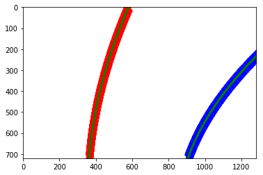

```python
import numpy as np
import cv2
import glob
import matplotlib.pyplot as plt
import matplotlib.image as mpimage
import pickle
import thresholding
import skimage.io as skimage

%matplotlib inline
```

# Camera calibration
### Compute camera calibration parameters and pickle dump them (run only once takes time)
To perform camera calibration, I used the images of a chessboard taken by the camera mounted on the car. I used opencv API to find the chessboard corners (the image points) and corresponding objects points. Depending on the image being processed, there is a grid of 5x9 object point or 6x9 objects points grid depending on the number of image points detected. Using the images points and corresponding object points thus found, I calculated the camera calibration parameters that are used to undistort images from this camera. See the code below for the procedure.
The parameters found a saved for later use.


```python
cal_images = glob.glob('./camera_cal/*.jpg')
objpoints = [] # 3d points in real world space
imgpoints = [] # 2d points in image plane.


# Step through the list and search for chessboard corners
for idx, fname in enumerate(cal_images):
    nx, ny = 6, 9
    objp = np.zeros((nx*ny,3), np.float32)
    objp[:,:2] = np.mgrid[0:nx, 0:ny].T.reshape(-1, 2)
    img = cv2.imread(fname)
    gray = cv2.cvtColor(img, cv2.COLOR_BGR2GRAY)

    # Find the chessboard corners
    ret, corners = cv2.findChessboardCorners(gray, (nx, ny), None)

    # If did not found image points try with 5, 9
    if not ret:
        nx, ny = 5, 9
        objp = np.zeros((nx*ny,3), np.float32)
        objp[:,:2] = np.mgrid[0:nx, 0:ny].T.reshape(-1, 2)
        ret, corners = cv2.findChessboardCorners(gray, (nx, ny), None)

    if ret == True:
        objpoints.append(objp)
        imgpoints.append(corners)


test_image = mpimage.imread('./test_images/test1.jpg')
img_size = (test_image.shape[1], test_image.shape[0])
ret, mtx, dist, rvecs, tvecs = cv2.calibrateCamera(objpoints, imgpoints, img_size, None, None)

dist_pickle = {}
dist_pickle["mtx"] = mtx
dist_pickle["dist"] = dist
pickle.dump(dist_pickle, open('camera_cal/camera_cal_pickle.p', 'wb'))


```

# Load Camera matrix and distortion coeffs


```python
camdata = pickle.load(open('./camera_cal/camera_cal_pickle.p', 'rb'))
mtx = camdata['mtx']
dist = camdata['dist']
persp = pickle.load(open('./camera_cal/persp_pickle.p', 'rb'))
M = persp['M']
Minv = persp['Minv']
```


```python
# helper function to undistort an image using opencv.
def undistort_image(img_arr, matrix, coeffs):
    return cv2.undistort(img_arr, matrix, coeffs, None, matrix)

# test on a sample image
chessboard = mpimage.imread('./camera_cal/calibration1.jpg')
undist_chessboard = undistort_image(chessboard, mtx, dist)

f, (ax1, ax2) = plt.subplots(1, 2, figsize=(24, 9))
f.tight_layout()
ax1.imshow(chessboard)
ax1.set_title('Original Image', fontsize=20)
ax2.imshow(undist_chessboard)
ax2.set_title('Undistorted image', fontsize=20)


```


    <matplotlib.text.Text at 0x120b70550>


As we can above, using the calibration parameters in `mtx` and `dist`, the chessboard image is clearly undistored compared to the same original image.

# Image Perspective transform

### Hand picked source and destination points and Perspective transform matrices
In this section, I hand picked 4 points in the original image `srcpts` in the code below and `dstpts` which represent where I want the `srcpts` to be after a perspective transform. Using opencv, the M transform matrix and Minv inverse transform matrix are computed as show in the code below.


```python
srcpts = np.float32([[254, 686], [617, 439], [661, 439], [1046, 676]])
dstpts = np.float32([[353, 718], [353, 10],  [894, 10], [894, 718]])


src_image = mpimage.imread('./test_images/straight_lines1.jpg')

plt.figure(figsize=(20, 10))

# Source an
plt.imshow(src_image)
plt.plot(254, 686, 'x')
plt.plot(617, 439, 'x')
plt.plot(661, 439, 'x')
plt.plot(1046, 676, 'x')

plt.plot(353, 710, 'o')
plt.plot(353, 10, 'o')
plt.plot(894, 10, 'o')
plt.plot(894, 710, 'o')


M = cv2.getPerspectiveTransform(srcpts, dstpts)
Minv = cv2.getPerspectiveTransform(dstpts, srcpts)

persp_pickle = {}
persp_pickle["M"] = M
persp_pickle["Minv"] = Minv
pickle.dump(persp_pickle, open('camera_cal/persp_pickle.p', 'wb'))

def perspective_change(imarr, matrix):
    return cv2.warpPerspective(imarr, matrix, (imarr.shape[1], imarr.shape[0]))
```


```python
undist = undistort_image(src_image, mtx, dist)
warp_image = cv2.warpPerspective(undist, M, (src_image.shape[1], src_image.shape[0]))

f, (ax1, ax2) = plt.subplots(1, 2, figsize=(20,10))
ax1.imshow(undist)
ax1.set_title('Original Image Undistorted', fontsize=30)
ax2.imshow(warp_image)
ax2.set_title('Warped Image', fontsize=30)

curved = mpimage.imread('./test_images/test2.jpg')
undist = undistort_image(curved, mtx, dist)
warp_image = cv2.warpPerspective(undist, M, (curved.shape[1], curved.shape[0]))

f, (ax1, ax2) = plt.subplots(1, 2, figsize=(20,10))
ax1.imshow(undist)
ax1.set_title('Original Image Undistorted', fontsize=30)
ax2.imshow(warp_image)
ax2.set_title('Warped Image', fontsize=30)

other_image = mpimage.imread('./test_images/signs_vehicles_xygrad.jpg')
undist = undistort_image(other_image, mtx, dist)
warp_image = cv2.warpPerspective(undist, M, (curved.shape[1], curved.shape[0]))

f, (ax1, ax2) = plt.subplots(1, 2, figsize=(20,10))
ax1.imshow(undist)
ax1.set_title('Original Image Undistorted', fontsize=30)
ax2.imshow(warp_image)
ax2.set_title('Warped Image', fontsize=30)


```


    <matplotlib.text.Text at 0x1206fd358>


#### Test the inverse transform
Below I test the inverse transform using Minv. I can clearly see the inverse transform recovers the area of the original image where the road is.


```python
unwarp_image = cv2.warpPerspective(warp_image, Minv, (warp_image.shape[1], warp_image.shape[0]))
plt.figure()
plt.imshow(other_image)
plt.figure()
plt.imshow(unwarp_image)
```


    <matplotlib.image.AxesImage at 0x1230b3668>


# Gradient and Color Thresholding
In this section, I prototype the gradient and color thresholding algorithms the will be used in a function later that  takes an image as input and returns a warped binary image trying to highlight pixels that correspond lane lines, used later to fit a coupe of polynomials. The code cells below are used for prototyping and fine tuning the thresholds values. The final function `threshold`that performs the thesholding and combines both color and gradient thresholing is located in the file thresholding.py in this repo.

## Example image used in the cells in this section


```python
# Test image
# orig_image = mpimage.imread('./test_images/signs_vehicles_xygrad.jpg')
orig_image = mpimage.imread('./test_images/test5.jpg')

image = undistort_image(orig_image, mtx, dist)

f, (ax1, ax2) = plt.subplots(1, 2, figsize=(24, 9))
f.tight_layout()
ax1.imshow(orig_image)
ax1.set_title('Original Image', fontsize=20)
ax2.imshow(image)
ax2.set_title('Undistorted image', fontsize=20)


```


    <matplotlib.text.Text at 0x11f66a748>


```python
def abs_sobel_thresh(img, orient='x', thresh_min=0, thresh_max=255, kernel_size=3, hls=False):
    # Convert to grayscale
    if hls:
        hls_image = cv2.cvtColor(img, cv2.COLOR_RGB2HLS)
        gray = hls_image[:,:,1]
    else:
        gray = cv2.cvtColor(img, cv2.COLOR_RGB2GRAY)
    # Apply x or y gradient with the OpenCV Sobel() function
    # and take the absolute value
    if orient == 'x':
        abs_sobel = np.absolute(cv2.Sobel(gray, cv2.CV_64F, 1, 0, ksize=kernel_size))
    if orient == 'y':
        abs_sobel = np.absolute(cv2.Sobel(gray, cv2.CV_64F, 0, 1, ksize=kernel_size))
    # Rescale back to 8 bit integer
    scaled_sobel = np.uint8(abs_sobel/np.max(abs_sobel)*255)
    # Create a copy and apply the threshold
    binary_output = np.zeros_like(scaled_sobel)
    # Here I'm using inclusive (>=, <=) thresholds, but exclusive is ok too
    binary_output[(scaled_sobel >= thresh_min) & (scaled_sobel <= thresh_max)] = 1

    # Return the result
    return binary_output


```


```python
# Test the function
grad_binary = abs_sobel_thresh(image, orient='x', thresh_min=35, thresh_max=150)

# Plot the result
f, (ax1, ax2) = plt.subplots(1, 2, figsize=(24, 9))
f.tight_layout()
ax1.imshow(image)
ax1.set_title('Original Image', fontsize=20)
ax2.imshow(grad_binary, cmap='gray')
ax2.set_title('Thresholded Gradient', fontsize=20)
plt.subplots_adjust(left=0., right=1, top=0.9, bottom=0.)
```


```python
# Test the function
grad_binary = abs_sobel_thresh(image, orient='y', thresh_min=50, thresh_max=80)

# Plot the result
f, (ax1, ax2) = plt.subplots(1, 2, figsize=(24, 9))
f.tight_layout()
ax1.imshow(image)
ax1.set_title('Original Image', fontsize=20)
ax2.imshow(grad_binary, cmap='gray')
ax2.set_title('Thresholded Gradient', fontsize=20)
plt.subplots_adjust(left=0., right=1, top=0.9, bottom=0.)
```


```python
def magnitude_thresh(img, sobel_kernel=3, mag_thresh=(0, 255)):
    # Convert to grayscale
    gray = cv2.cvtColor(img, cv2.COLOR_RGB2GRAY)
    # Take both Sobel x and y gradients
    sobelx = cv2.Sobel(gray, cv2.CV_64F, 1, 0, ksize=sobel_kernel)
    sobely = cv2.Sobel(gray, cv2.CV_64F, 0, 1, ksize=sobel_kernel)
    # Calculate the gradient magnitude
    gradmag = np.sqrt(sobelx**2 + sobely**2)
    # Rescale to 8 bit
    gradmag = (gradmag/np.max(gradmag)*255).astype(np.uint8) 
    # Create a binary image of ones where threshold is met, zeros otherwise
    binary_output = np.zeros_like(gradmag)
    binary_output[(gradmag >= mag_thresh[0]) & (gradmag <= mag_thresh[1])] = 1

    # Return the binary image
    return binary_output

```


```python
# Test the function
mag_binary = magnitude_thresh(image, sobel_kernel=3, mag_thresh=(50, 80))
# Plot the result
f, (ax1, ax2) = plt.subplots(1, 2, figsize=(24, 9))
f.tight_layout()
ax1.imshow(image)
ax1.set_title('Original Image', fontsize=20)
ax2.imshow(mag_binary, cmap='gray')
ax2.set_title('Thresholded Gradient', fontsize=20)
plt.subplots_adjust(left=0., right=1, top=0.9, bottom=0.)
```


```python
def dir_threshold(img, sobel_kernel=3, thresh=(0, np.pi/2)):
    # Grayscale
    gray = cv2.cvtColor(img, cv2.COLOR_RGB2GRAY)
    # Calculate the x and y gradients
    sobelx = cv2.Sobel(gray, cv2.CV_64F, 1, 0, ksize=sobel_kernel)
    sobely = cv2.Sobel(gray, cv2.CV_64F, 0, 1, ksize=sobel_kernel)
    # Take the absolute value of the gradient direction, 
    # apply a threshold, and create a binary image result
    absgraddir = np.arctan2(np.absolute(sobely), np.absolute(sobelx))
    binary_output =  np.zeros_like(absgraddir)
    binary_output[(absgraddir >= thresh[0]) & (absgraddir <= thresh[1])] = 1

    # Return the binary image
    return binary_output
```


```python
dir_binary = dir_threshold(image, sobel_kernel=15, thresh=(.9, 1.3))
# Plot the result
f, (ax1, ax2) = plt.subplots(1, 2, figsize=(24, 9))
f.tight_layout()
ax1.imshow(image)
ax1.set_title('Original Image', fontsize=50)
ax2.imshow(dir_binary, cmap='gray')
ax2.set_title('Thresholded Grad. Dir.', fontsize=50)
plt.subplots_adjust(left=0., right=1, top=0.9, bottom=0.)
```


### Combined direction, magnitude and absolute gradients


```python

gradx_binary = abs_sobel_thresh(image, orient='x', thresh_min=30, thresh_max=150, kernel_size=9)
grady_binary = abs_sobel_thresh(image, orient='y', thresh_min=50, thresh_max=70, kernel_size=9)
mag_binary = magnitude_thresh(image, sobel_kernel=5, mag_thresh=(45, 80))
dir_binary = dir_threshold(image, sobel_kernel=7, thresh=(0.75, 1.3))

combined = combined = np.zeros_like(dir_binary)
combined[((gradx_binary == 1) & (grady_binary == 1)) | ((mag_binary == 1) & (dir_binary == 1))] = 1

plt.figure(figsize=(20,10))
plt.imshow(combined, cmap='gray')
plt.imsave('./writeup_images/signs_vehicles_xygrad_binary.jpg', combined, cmap='gray')

```


### HLS color space thresholding


```python
hls = cv2.cvtColor(image, cv2.COLOR_RGB2HLS)
s_channel = hls[:,:,2]
import PIL

s_thresh_min = 120
s_thresh_max = 255

s_binary = np.zeros_like(s_channel)
s_binary[(s_channel >= s_thresh_min) & (s_channel <= 255)] = 1

color_and_gradient = np.zeros_like(s_channel)
color_and_gradient[(s_binary == 1) | (combined == 1)] = 1
plt.imsave('./writeup_images/gradient_and_color_thresh.jpeg', color_and_gradient, cmap='gray')
f, axes = plt.subplots(nrows=4, ncols=1, figsize=(20, 20))

axes[0].set_title('Original undistorted image')
axes[0].imshow(image)
axes[1].set_title('HLS S channel')
axes[1].imshow(s_channel, cmap='gray')
axes[2].set_title('S channel thesholding')
axes[2].imshow(s_binary, cmap='gray')
axes[3].set_title('Combined S channel and gradient thresholds')
axes[3].imshow(color_and_gradient, cmap='gray')
```


    <matplotlib.image.AxesImage at 0x120736550>


The result of the combined thresholdings, in the warped  binart image below, shows the the algorithm highlights the lane lines (right and left) but also the shadow of the tree on the left which visible as the horizontal splash of pixels on the image. This will make the line detection problematic.


```python
binary_warped = cv2.warpPerspective(color_and_gradient, M, (image.shape[1], image.shape[0]))
f, (ax1, ax2) = plt.subplots(1, 2, figsize=(20,10))
ax1.imshow(color_and_gradient, cmap='gray')
ax1.set_title('Undistorted Image', fontsize=20)
ax2.imshow(binary_warped, cmap='gray')
ax2.set_title('Warped Image', fontsize=20)


```


    <matplotlib.text.Text at 0x122d63438>


```python
def color_grad_thresh_warp_pipeline(img):
    """
    This function take a image as input and does the following
    - Undistort the image using cam cal data
    - Apply gradient thresholding and color thresholding and combine in a binary image
    - warp the image
    return the result
    """
    _undistorted_img = undistort_image(img, mtx, dist)
    
    
    _gradx_binary = abs_sobel_thresh(_undistorted_img, orient='x', thresh_min=20, thresh_max=100, kernel_size=7)
    
    _grady_binary = abs_sobel_thresh(_undistorted_img, orient='y', thresh_min=30, thresh_max=100, kernel_size=7)
    
    _mag_binary = magnitude_thresh(_undistorted_img, sobel_kernel=5, mag_thresh=(40, 100))
    
    _dir_binary = dir_threshold(_undistorted_img, sobel_kernel=7, thresh=(.9, 1.3))
    
    _combined = np.zeros_like(_dir_binary)
    
    _combined[((_gradx_binary == 1) & (_grady_binary == 1)) | ((_mag_binary == 1) & (_dir_binary == 1))] = 1
    
    _hls = cv2.cvtColor(img, cv2.COLOR_RGB2HLS)
    _schannel = _hls[:,:,2]
    _sthresh_min = 130
    _sthresh_max = 255
    _sbinary = np.zeros_like(_schannel)
    _sbinary[(_schannel >= _sthresh_min) & (_schannel <= 255)] = 1

    _color_and_gradient = np.zeros_like(_schannel)
    _color_and_gradient[(_sbinary == 1) | (_combined == 1)] = 1
    return perspective_change(_color_and_gradient, M)


input_img = mpimage.imread('./test_images/test4.jpg')
# res = pipeline.color_grad_thresh_warp_pipeline(input_img, mtx, dist, M)
res = color_grad_thresh_warp_pipeline(input_img)


f, (ax1, ax2) = plt.subplots(1, 2, figsize=(24, 9))
f.tight_layout()

ax1.imshow(input_img)
ax1.set_title('Original Image', fontsize=30)

ax2.imshow(res, cmap='gray')
ax2.set_title('Output Image', fontsize=30)

plt.subplots_adjust(left=0., right=1, top=0.9, bottom=0.)

plt.figure()
histogram = np.sum(res[res.shape[0]//2:,:], axis=0)
plt.plot(histogram)
```


    [<matplotlib.lines.Line2D at 0x110446048>]


# Find the lane
In this section I prototype lane finding using a histrogram, sliding window algorithm and polynomial fitting.
The final lane detection code is the LaneDetector class in the lanefinder.py file.


```python
lanes_image = plt.imread('./test_images/test1.jpg')
plt.figure()
plt.imshow(lanes_image)
binary_warped = thresholding.threshold(lanes_image, mtx, dist, M)
mpimage.imsave('./output_images/binary_warped_test6.jpg', binary_warped, cmap='gray')

histogram = np.sum(binary_warped[binary_warped.shape[0]//2:,:], axis=0)
plt.figure()
plt.plot(histogram)

plt.figure()
plt.imshow(binary_warped, cmap='gray')
```


    <matplotlib.image.AxesImage at 0x120aac390>


```python
def weighted_img(img, initial_img, α=0.8, β=1., λ=0.):
    return cv2.addWeighted(initial_img, α, img, β, λ)

# Create an output image to draw on and  visualize the result
out_img = np.dstack((binary_warped, binary_warped, binary_warped)) * 255
# Find the peak of the left and right halves of the histogram
# These will be the starting point for the left and right lines
midpoint = np.int(histogram.shape[0] / 2)
leftx_base = np.argmax(histogram[:midpoint])
rightx_base = np.argmax(histogram[midpoint:]) + midpoint

# Choose the number of sliding windows
nwindows = 9
# Set height of windows
window_height = np.int(binary_warped.shape[0] / nwindows)

# Identify the x and y positions of all nonzero pixels in the image
nonzero = binary_warped.nonzero()
print(type(nonzero))
nonzeroy = np.array(nonzero[0])
print(nonzeroy)
nonzerox = np.array(nonzero[1])
# Current positions to be updated for each window
leftx_current = leftx_base
rightx_current = rightx_base
# Set the width of the windows +/- margin
margin = 100
# Set minimum number of pixels found to recenter window
minpix = 50
# Create empty lists to receive left and right lane pixel indices
left_lane_inds = []
right_lane_inds = []

# Step through the windows one by one
for window in range(nwindows):
    # Identify window boundaries in x and y (and right and left)
    win_y_low = binary_warped.shape[0] - (window + 1) * window_height
    win_y_high = binary_warped.shape[0] - window * window_height

    # left window
    win_xleft_low = leftx_current - margin
    win_xleft_high = leftx_current + margin
    # right window
    win_xright_low = rightx_current - margin
    win_xright_high = rightx_current + margin

    # Draw the windows on the visualization image
    cv2.rectangle(out_img, (win_xleft_low, win_y_low),
                  (win_xleft_high, win_y_high), (0, 255, 0), 2)
    cv2.rectangle(out_img, (win_xright_low, win_y_low),
                  (win_xright_high, win_y_high), (0, 255, 0), 2)

    # Identify the nonzero pixels in x and y within the window
    good_left_inds = ((nonzeroy >= win_y_low) & (nonzeroy < win_y_high) & (
        nonzerox >= win_xleft_low) & (nonzerox < win_xleft_high)).nonzero()[0]

    good_right_inds = ((nonzeroy >= win_y_low) & (nonzeroy < win_y_high) & (
        nonzerox >= win_xright_low) & (
            nonzerox < win_xright_high)).nonzero()[0]

    # Append these indices to the lists
    left_lane_inds.append(good_left_inds)
    right_lane_inds.append(good_right_inds)
    # update the window center position for the next iteration
    if len(good_left_inds) > minpix:
        leftx_current = np.int(np.mean(nonzerox[good_left_inds]))

    if len(good_right_inds) > minpix:
        rightx_current = np.int(np.mean(nonzerox[good_right_inds]))


# Concatenate the arrays of indices
left_lane_inds = np.concatenate(left_lane_inds)
right_lane_inds = np.concatenate(right_lane_inds)

# Extract left and right line pixel positions
# left lane line pixels
leftx = nonzerox[left_lane_inds]
lefty = nonzeroy[left_lane_inds]

# right lane line pixels
rightx = nonzerox[right_lane_inds]
righty = nonzeroy[right_lane_inds]

# Fit a second order polynomial to each
left_fit = np.polyfit(lefty, leftx, 2)
right_fit = np.polyfit(righty, rightx, 2)

# Generate x and y values for plotting
ploty = np.linspace(0, binary_warped.shape[0]-1, binary_warped.shape[0])

# left line x coordinates
left_fitx = left_fit[0]*ploty**2 + left_fit[1]*ploty + left_fit[2]
# right line x coordinates
right_fitx = right_fit[0]*ploty**2 + right_fit[1]*ploty + right_fit[2]

# out_img[nonzeroy[left_lane_inds], nonzerox[left_lane_inds]] = [255, 0, 0]
# out_img[nonzeroy[right_lane_inds], nonzerox[right_lane_inds]] = [0, 0, 255]

plt.figure()
plt.imshow(binary_warped, cmap='gray')
plt.figure()
plt.imshow(out_img)

plt.plot(left_fitx, ploty, color='yellow')
plt.plot(right_fitx, ploty, color='yellow')
plt.xlim(0, 1280)
plt.ylim(720, 0)

# f, (ax1, ax2) = plt.subplots(1, 2, figsize=(20,10))
# ax1.imshow(out_img)
# ax2.imshow(perspective_change(out_img, Minv))

f, axes = plt.subplots(nrows=4, ncols=1, figsize=(20, 20))

axes[0].imshow(out_img, cmap='gray')
axes[1].set_title('Lane lines detection')
axes[1].imshow(perspective_change(out_img, Minv))
axes[2].set_title('Original undistorted image')
axes[2].imshow(lanes_image)
axes[3].set_title('Original undistorted image')
axes[3].imshow(weighted_img(lanes_image, perspective_change(out_img, Minv)))

plt.imsave('./output_images/lines_detected.jpg', weighted_img(lanes_image, perspective_change(out_img, Minv)))

```

    <class 'tuple'>
    [  0   0   0 ..., 719 719 719]


## Testing the LaneDetector


```python
import lanefinder

plt.figure()
plt.imshow(lanes_image)
# binary_warped = plt.imread('./test_images/warped_example.jpg')
laneDetector = lanefinder.LaneDetector()
laneDetector.detect(binary_warped)
leftx, rightx, ploty = laneDetector.get_lines(binary_warped)
lane = laneDetector.draw_lane(binary_warped, Minv)
canvas = np.zeros_like(binary_warped)

plt.figure()
plt.imshow(canvas, cmap='gray')

plt.plot(leftx, ploty, color='yellow')
plt.plot(rightx, ploty, color='yellow')
plt.xlim(0, 1280)
plt.ylim(720, 0)

left_fit = np.polyfit(ploty, leftx, 2)
left_fitx = left_fit[0]*ploty**2 + left_fit[1]*ploty + left_fit[2]

right_fit = np.polyfit(ploty, rightx, 2)
right_fitx = right_fit[0]*ploty**2 + right_fit[1]*ploty + right_fit[2]

plt.figure()

# Plot up the fake data
mark_size = 10
plt.plot(leftx, ploty, 'x', color='red', markersize=mark_size)
plt.plot(rightx, ploty, 'x', color='blue', markersize=mark_size)
plt.xlim(0, 1280)
plt.ylim(0, 720)
plt.plot(left_fitx, ploty, color='green', linewidth=3)
plt.plot(right_fitx, ploty, color='green', linewidth=3)
plt.gca().invert_yaxis() # to visualize as we do the images

y_eval = np.max(ploty)
left_curverad = ((1 + (2*left_fit[0]*y_eval + left_fit[1])**2)**1.5) / np.absolute(2*left_fit[0])
right_curverad = ((1 + (2*right_fit[0]*y_eval + right_fit[1])**2)**1.5) / np.absolute(2*right_fit[0])
print(left_curverad, right_curverad)

lane_on_image = weighted_img(lanes_image, lane)
plt.imsave('./output_images/test1_lane_on_road.png', lane_on_image)
plt.figure()
plt.imshow(lane_on_image)
```

    1799.13619087 831.078276921


    <matplotlib.image.AxesImage at 0x120ced6a0>





# The final pipline and video processing
The pipeline is coded in the Pipeline class in the pipeline.py file. The pipeline consists in generating the binary warped image of from the current frame, then thresholding to select the lane lines pixels, than fitting those pixels to y values to obtain two polynomials that describe the left and right curves or lane lines. The lane is then drawed on the frame, the curvature and displacement of the car from the center of the lane are also calculated and drawn on the output frame.

A note about how the detection algorithm works: the input is a warped binary image containing only the lines isolated using thresholding. For first frame, the sliding window algorithm is used to find the pixels of the left and right lines. The detector checks if the the top and base lane widths are within a acceptable range in meters to decide if the a lane was detected or not. If a lane is found, the algorithm adds the polynomials describing the lines to a circular buffer of size 4 which is used to create an average of the left and right polynomials coefficients over the last 4 frames where the lane was detected. If for a particular frame, the lane was not detected those averaged polynomials are used instead of the current ones. Also if the lane lines are not found 3 times in a row, the sliding window search kicks in again the next frame.


```python
import pipeline
import matplotlib.image as mpimage

other_image = mpimage.imread('./test_images/signs_vehicles_xygrad.jpg')
p = pipeline.Pipeline(mtx, dist, M, Minv)
plt.imshow(p.process_frame(other_image))
```


    <matplotlib.image.AxesImage at 0x100fb4e10>


```python
from moviepy.editor import VideoFileClip
from IPython.display import HTML

stream_output = './project_video_output.mp4'
clip = VideoFileClip('./project_video.mp4')
processed_clip = clip.fl_image(p)
processed_clip.write_videofile(stream_output, audio=False)
```

    [MoviePy] >>>> Building video ./project_video_output.mp4
    [MoviePy] Writing video ./project_video_output.mp4


    100%|█████████▉| 1260/1261 [07:40<00:00,  2.44it/s]


    [MoviePy] Done.
    [MoviePy] >>>> Video ready: ./project_video_output.mp4 
    


```python
HTML("""
<video width="960" height="540" controls>
  <source src="{0}">
</video>
""".format(stream_output))
```


<video width="960" height="540" controls>
  <source src="./project_video_output.mp4">
</video>


[](https://www.youtube.com/watch?v=PXS1B4T9E_M)


# Final discussion
fine tuning the different thresholds is tricky even with a lot of tuning the result can be inconsistent. Object like cars very close to the lane lines and espcially shadows and artifacts on the lane are challenging to remove using thresholding and thus pixels corresponding to those elements are unduly selected as line pixels using the histogram and window search technique and thus the resulting polymonials do not describe the lines correctly. Clearly using only image processing alone is not enough to make sense of the environment of the car and particularly to detect the lane lines.
